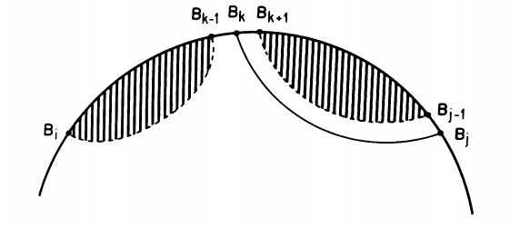
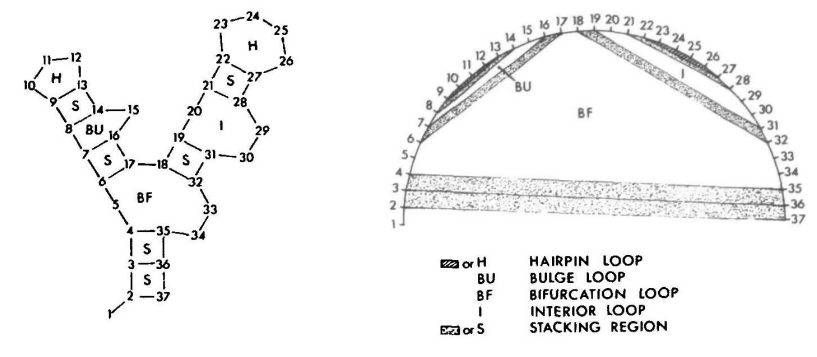
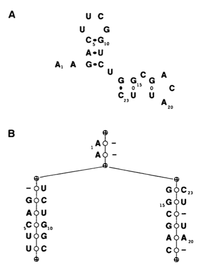
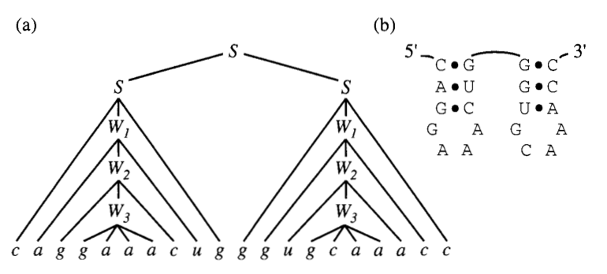
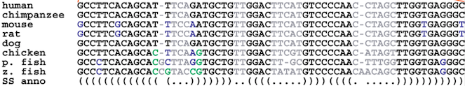

As part of the CS PhD program, students have to pass an oral exam after their first year. The exam is based on a literature review written by the student on a field in Computer Science. Since it is related to my research, I chose to write about RNA structure prediction and classification. In order to prepare for the oral exam, I'm taking notes on all the papers I reviewed and figures I could post them in case anyone else was interested. 	

I will cover techniques for RNA 2D then 3D structure modelling, prediction, and classification. The format is like a cheat sheet as I want to retain the key pieces of information. For a more 'review' style treatment have a look at my literature [review]({{site.url}}/assets/review_cgo.pdf).

When relevant I will outline the following information for each technique:

* Definition of the problem
* Justification (past results and shortcomings)
* Algorithm employed
* General properties of class of algorithm
* Time and space complexity
* Empirical performance (accuracy, etc.)
* Limitations and caveats

The computer science topics are mostly: dynamic programming, stochastic grammars, constraint statisfaction, statistical graphical models, and graph algorithms.

All images and material (unless a link is included) are taken from the papers cited in the literature review.

Disclaimer: This is not proofread so there may be some mistakes in the text. And towards the end of the notes I started to get tired so they get progressively less detailed so my apologies for that. If I have time I will go back and add or fix anything that needs it. Enjoy!


### RNA 2D Structure Prediction 

#### Nussinov Algorithm (1980) 

**Problem representation:**

We write a sequence $\omega$ as a word from the alphabet $\{\texttt{A, U, C, G\}}$. A secondary structure $s$ on $\omega$ is a set of pairs $(i, j)$ of indices in $\omega$ that obey the following rules:

* $i \neq j$ and each base can only pair with one other base
* $\omega_i\omega_j \in \{\texttt{AU}, \texttt{CG}, \texttt{GU}\}$
* Given other pair $(k, l)$ we have $i < k < l < j$ or $k < i < j < l$ $\rightarrow$ no pseudoknots
* $j - i < p$ for some integer $p$. Typically choose 3. Sets the minimum loop size.


**Previous approaches:** Identify all sets of valid helices (watson-crick pairing segments) and use approximate energy functions to find the minimum energy structure. This was very slow due to high number of combinations to consider and intractable on larger sequences.

**Goal:** compute maximally paired secondary structure for a given sequence.

**Approach:** 

* *Dynamic Programming (DP):*  optimization method used for problems with two key characteristics, *an optimal sub-structure* and *overlapping sub-problems*. The solution to DP problems can be computed by optimally solving smaller problems and storing the solution in a data structure (memoization). The algorithm iterates over the sub-problems such that at the current step it can look up the previously stored solutions to the smaller sub-problems instead of re-computing. 


**Algorithm:**

The Nussinov algorithm builds the maximally paired secondary structure. 

We define $OPT(i, j)$ to be a function that returns the maximum number of basepairs on the subsequence in the interval $[i, j]$. 

The problem is solved using DP and the following recursion:

$$ OPT(i, j) = \max \begin{cases}
\max_{k } [OPT(i, k-1) + OPT(k+1, j-p) + 1] &\text{$j$ paired with}\\
														& \text{ $k \in [i, j-1]$}\\
OPT(i, j-1)  \ &\text{$j$ unpaired}
\end{cases}
$$

This recursion says that the maximum number of base pairs on a subsequence between $i$ and $j$ is the maximum of two cases. 

1. The base $j$ forms a pair with another base $k$ on the interval $[i, j-p]$. This gives us two optimal substructure $OPT(i, k-1)$ and $OPT(k+1, j-1)$ and we add 1 to count the formed base pair. At this iteration, the algorithm tests all possible values of $k$ to find the one with the maximum value.
2. There is no pairing $k$ with $j$ so we just compute the optimal solution on $OPT(i, j-1)$ 

*Optimal sub-structure*: We say that a problem has an optimal substructure if the optimal solution is a combination of optimal solutions to smaller problems. This decomposition is possible thanks to the fact that we don't allow any crossing interactions (pseudoknots) in the secondary structure. In this setting, any pair between two positions $(j, k)$ will form two substructures whose pairs are strictly nested within the basepair $(j, k)$ and so we can independently compute the optimal structure on the two sub-structures.

We also have the base case where $j - i < p$ so we know that it is impossible to have a base pair in that interval and so $OPT(i, j) = 0$. 

  
<!---->

*Overlapping sub-problems:* DP performs best when computing the solution to a sub-structure, the algorithm has previously encountered and stored the solutions required for the current step. This is clearly the case for RNA structure since we can obtain $OPT(i, j)$ as a function of previously computed values $OPT(i, k-1)$, $OPT(k+1, j-1)$, and $OPT(i, j-1)$ by computing $OPT$ on intervals of increasing length. Therefore $OPT$ will actually be a matrix of size $N \times N$ that will store the computed values after each iteration.


Once the matrix is filled, we have the maximum number of base pairs on every sub-string of the sequence and $OPT(1, N)$ storing the score for the whole sequence. Obviously, this is not what we were looking for which is the secondary structure. To obtain the structure we perform what is known as a *backtracking* procedure to reconstruct the optimal structure. 

Optionally, one could store a pointer during the computation of $OPT$ that stores which case in the recursion was used at each step. Otherwise, this is how the backtracking works:

```python
backtrack(i, j):
	if j < i:
		return
	elif OPT[i][j] == OPT[i][j-1]:
		backtrack(i, j-1)
		return
	else:
		for k such that i < k < j-p and (i, k) complimentary:
			if OPT[i][j] == OPT[i][k-1] + OPT[k+1][j-1] + 1:
				print(k, j are paired)
				backtrack(i, k-1)
				backtrack(k+1, j-1)
				return
```
So we start from the whole sequence $OPT(1, N)$ and see if $j$ forms a pair. If $OPT(i, j) == OPT(i, j-1)$ it means that $j$ was not paired as the score remains the same. Otherwise we have to search for the $k$ that pairs with $j$ which we do inside a for loop. If we find that some $k$ explains the score at $OPT(i, j)$ then we print the pair $(j, k)$ and recurse to the two substructures formed by the pair.

**Complexity:**

* Filling the matrix: $\mathcal{O}(N^3)$ For each pair of indices we have to do on the order of $N$ searches for a base pair $k$. 
* Backtrack: $\mathcal{O}(N^2)$. If all bases unpaired then you fall into the second `if` each time and go through the sequence in $N$ steps. If at each step you have to look for a pair then at worst you go through each other position $N$ times to get $\mathcal{O}(N^2)$.
* Space: since we are simply filling a matrix and all computations are done on the same matrix storage is only $\mathcal{O}(N^2)$. 

**Limitations:** 

* No distinction between base pair types
* No consideration of stacking bases to stability or single stranded regions as de-stabilizing contributions.
* Consequently, Nussinov prediction does not yield very realistic structures.
* However, Nussinov also descrives a procedure for incorporating contextual information in the addition of base pairs as part of the backtracking. 

#### Zuker's Algorithm (1981)

The fundamental unit of the Nussinov algorithm is the base pair. However, experimentally derived energy values for RNA structure  are done on larger secondary structure units. More specifically on loops and stacks. Therefore, an algorithm that can leverage this information to identify a minimal free energy instead of a maximally paired structure stands to yield more accurate results.

**Problem Representation:*

Zuker defines the elementary unit of a secondary structure as a *face*. We think of RNA 2D structure as a planar graph where nodes are bases and edges are interactions connecting the bases. We then distinguish between two types of edges: external edges connect the backbone of the RNA, and internal edges connect a pair of bases. Finally, a *face* is a planar region bounded on all sides by edges. The image below shows two representations of an RNA structure with its faces labeled. 

<!---->
  

We can see that a *hairpin* is a face with one internal edge. A stack is defined by two consecutive internal edges. Bulges and internal loops have two internal edges that are separated by one (bulge) or more (internal loop) exterior edges on one side. Bifurcation loops are faces with three or more interior edges. With the exception of the bifurctaion loop, the Zuker algorithm uses experimentally derived energy values for each of the types of faces.

**Approach:** DP

**Algorithm:** 

The Zuker algorithm is a somewhat slight modification of the Nussinov algorithm but dealing with faces instead of base pairs.

We define following terms:

* $W(i, j)$ is a DP table which contains the energy of the minimum energy structure on the interval $[i, j]$.
* $V(i, j)$ is a DP table contains the energy of the minimum energy structure on the interval $[i, j]$ where $(i, j)$ are paired.
* $E(F)$ is the energy of a given face. For example, if F is a stacking region we would have $E(F) = -1.8$ kcal/mol as this would be a stabilizing element.

The optimal energy will be stored in $W(1, N)$. Which can then be used to reconstruct the optimal structure using a similar backtracking procedure to the one used by Nussinov.

In order to fill the tables we apply the following recursions:


$$V(i, j) = min\{E1, E2, E3\}$$

Where

$$E1 = E(FH(i,j)) $$

$$E2 = \min_{i < i' < j' < j} \{E(FL(i, j, i', j')) + V(i', j')\} $$

$$E3 = \min_{i+1 < i' < j-2} \{W(i+1, i') + W(i'+1, j-1)\} $$

So for $V(i, j)$ we take the minimum over three possible cases. 

* $E1$ is a simple hairpin loop formed by a single interior loop $(i, j)$.
* $E2$ Is the structure with two interior edges $(i, j), (i', j')$ where $(i', j')$ is nested inside $(i, j)$. This can form a stack if the two internal edges are contiguous, or a bulge/interior loop if they are not. The recursion here scans through all valid $(i', j')$ and takes the minimum.
* In the case of $E3$, $(i, j)$ define a bifurcation and thus the formation of two independent substructures $W(i+1, i')$ and $W(i'+1, j-1)$. Remember $W(i,j)$ stores the energy of the optimal structure between $[i,j]$ regardless of whether $i$ and $j$ are paired.	

Now we have to fill $W$.

$$
W(i, j) = \min\{W(i+1, j), W(i, j-1), V(i, j), E4\}
$$

Where:

$$E4 = \min_{i < i' < j' < j} \{W(i, i') + W(i' +1 , j)\}$$


We consider three possibilities for $i$ and $j$: 

1. $i$ or $j$ are not paired with any other base. So we just take the value $W(i+1, j)$ or $W(i, j-1)$ respectively.
2. $i$ and $j$ are paired. We already computed this and find it in $V(i, j)$.
3. $i$ and $j$ are paired but not with each other but instead pair with nested bases $i'$ and $j'$ (s.t. $i < i' < j' < j$. We can then decompose this as $W(i, i') + W(i'+1, j) = W(i, j'-1) + W(j', j)$.

Finally, as with the Nussinov algorithm, we have the base case as the entries where $i$ and $j$ are too close to form any nested structures so their energy values can be read off directly without further computation.

**Complexity:** Time and space complexity are the same as for Nussinov.

**Limitations:** The main contribution of this algorithm was its ability to incorporate experimental and evolutionary information to the predictions which showed that this additional information was crucial to improving predictions. The main drawback is that Zuker's algorithm does not yield suboptimal structures. This was addressed later by other algorithms.


### RNA 2D Classification

Zuker's algorithm demonstrated the importance of additional information to the prediction of accurate RNA secondary structures. One very important type of external information is evolutionary conservation. It is widely know that because non-coding RNA function is determined mainly by its structure, natural selection acts on the structure allowing the sequence to vary a fair amount. Therefore by comparing sequences of homologous RNAs we can see see that compensatory mutations emerge that preserve the RNA's structure. Knowing this, there arose a need for tools that were able to model the sequence variation in natural RNAs in a way that can be used to improve structural prediction and automatically build libraries of **RNA families** whose members share a common 2D structure.
 

#### Covariance Models (1994)

The most widely used framework for modelling RNA structural families is known as a Covariance Model and was simultaneously proposed in 1994 by Eddy and Rivas.

**Problem representation:** 

The main idea with CMs is to model structural families as *Stochastic Context Free Grammars (SCFGs).* Grammars were initially used by Noam Chomsky to model the rules that generate language. Applying this to RNA, we can think of an RNA structural family as a language, and all the sequences that belong to that family as words or sentences that can be produced from that grammar's rules.

In this context it is useful to think of RNAs as ordered binary tress.

<!---->
  

The usual representation of an RNA 2D structure can be seen in A and its translation into a tree is shown in B. Each node represents a left or right singlet, a bifurcation or a base pairing. We can see that starting from the root of the tree and writing the sequence found in the node we can reconstruct the structure in A. 

More generally, can write the corresponding grammar rules for this kind of tree:

$$ S \rightarrow xSy  | xS | Sx | SS | \epsilon $$

These rules can be thought of as "rewriting rules". The upper case symbols are called "non-terminals" and lowercase symbols are called "terminals". Non-terminals are replaced by one of five the re-writing rules (above). When the sequence consists only of "terminals" then we are done. For example, we can re rewrite $S$ with one of the four possible re-writing rules. For example, $aSb$ replaces $S$ with a base $x, y \in \{A,U,C,G\}$ to the left and to the right forming a base pair. The $SS$ state implies a bifurcation in the structure as each non-terminal starts a new branch of the sequence. The $\epsilon$ state ends the string as it does not contain any non-terminal for further re-writing. 

If we wanted to write the structure above using these rules we would have a set of re-writings as follows:

$$\begin{align} S \implies aS \implies aS \implies S_1S_2 \\ 
&\implies S_1u \implies gS_1c \implies a S_1 u ... \epsilon \\
&\implies gS_2c \implies gS_2c \implies cS_1 ... \epsilon \end{align} $$

We can represent derivations like this using what is known as a 'parse tree'. (below)

<!---->
  


This is a good representation of a single sequence and structure. However, an RNA family consists of multiple different sequences that belong to the same structure. Therefore we need to introduce some sequence variability and structural context information in the nodes of this tree. 

The way sequence variation is typically identified in bioinformatics is with a multiple sequence alignment (MSA). We can think of an MSA as a matrix $A$ where $A[i][j]$ is character $j$ of sequence $i$. The character set in an MSA contains the four bases and a special "gap" character written "-" which implies that character $j$ was deleted from the sequence with respect to the conserved consensus. Characters in each row of the matrix are arranged so that the entropy of each column $j$ is minimized and therefore conserved positions can be identified. So to model a family of RNAs we build a tree whose nodes capture the sequence variability in the MSA and the correlations in the secondary structure. Nodes can emit single bases, paired bases, insertions and deletions *with some probability* (hence, stochastic). As with the first example, a traversal of an SCFG generates members of the alignment in a probabilistic manner.

<!---->
  

([Source](http://journals.plos.org/ploscompbiol/article?id=10.1371/journal.pcbi.0020033))

**Algorithm(s):**

There are three main challenges in dealing with SCFGs:

1. Given a CM and an observed sequence, how do the characters in the sequence align with the states of the CM? $\rightarrow$ alignment problem.
2. Given a CM and an observed sequence, what is the likelihood that the CM generates that sequence? $\rightarrow$ scoring problem.
3. Given a set of sequences and structures, what set of SCFG states and parameters best represents the sequences? $\rightarrow$ training problem.

*Alignment problem*

The task is to associate each nucleotide in a sequence $\omega$ with a state in the SCFG $\mathcal{G}$. 

Once again, we use our friend DP to break down the problem into smaller sub-problems and iteratively compute the full solution. In this case, we will want a DP table that contains the maximum likelihood of aligning $\mathcal{G}$ to the interval $[i, j]$. Additionally, we also need to compute most likely state $y \in M$ (given $M$ states) for an internal $[i, j]$. We can think of $y$ as the root of subtree in the parse tree which covers $[i, j]$. This produces a 3 dimensional matrix $S_{i, j, y} \in \mathbb{R}^{N X N X M}$. At the end of the algorithm we will have the likelihood of the optimal alignment of the sequence to the root of the state tree will be stored in $S_{1, N, 1}$ and can reconstruct the alignment with backtracking.

Each element in the matrix is the sum of three likelihood terms.:

1. The symbol emission probability of emitting characters $x_i$ to the left, and/or $x_y$ to the right or neither given state $y$ $\rightarrow$ $\log P(x_i, x_j  \vert y)$
2. The state transition probability of going from $y$ to $y_{next}$ $\rightarrow$ $\log P(y_{next} \vert y)$
3. Depending on $y$ we need to include the score of aligning the remaining sub-structure. For example, if $y$ is a pair of matches, the remaining alignment will be $S_{i+1, j-1, y_{next}}$

For each subsequence, we iterate over all the possible sub-trees $y = {1, 2, ..., M}$.

$$
\begin{align}
S_{i, j, y}(y = \texttt{MATP}) &= \max_{y_{next}}[S_{i+1, j-1, y_{next}} + \log \mathcal{T}(y_{next} \vert y) + \log\mathcal{P}(x_i, x_j \vert y)] \\
S_{i, j, y}(y = \texttt{MATL/INSL}) &= \max_{y_{next}}[S_{i+1, j, y_{next}} + \log\mathcal{T}(y_{next} \vert y) + \log\mathcal{P}(x_i \vert y)]\\
S_{i, j, y}(y = \texttt{MATR/INSR}) &= \max_{y_{next}}[S_{i, j-1, y_{next}} + \log\mathcal{T}(y_{next} \vert y) + \log\mathcal{P}(x_j \vert y)]\\
S_{i, j, y}(y = \texttt{DEL}) &= \max_{y_{next}}[S_{i, j, y_{next}} + \log(y_{next} \vert y) \\
S_{i, j, y}(y = \texttt{BIFURC}) &= \max_{i-1 \leq mid \leq j}[S_{i, mid, y_{left}} + S_{mid+1, j, y_{right}}] \\
\end{align}
$$

The possible states reflect how a sequence may align with the consensus as emitted by the model.

* $\texttt{MATP}$ emits a base to the left and a base to the right which are paired in the consensus structure and match the alignment.
*  $\texttt{MAT(L/R)}$ emits a base to the left or right which matches the consensus but is not paired in the secondary structure 
*  $\texttt{INS(R/L)}$ emits an base that is inserted in the consensus.
*  $\texttt{DEL}$ emits nothing which creates a gap in the sequence.
*  $\texttt{BIFURC}$ emits nothing but splits the structure into two independent branches.

**Complexity:** $\mathcal{O}(N^2M)$ memory and $\mathcal{O}(N^3M)$ time.

By assuming that the probability of a sequence being emitted by a model is approximately equal to the probability of the optimal alignment to that sequence (what we just solved) we solve the alignment and scoring problem in one shot. This also means that we get a single probability for a given sequence instead of a probability distribution over all possible alignments which is what the *inside algorithm* computes. This simplifying assumption clearly introduces some bias to the model but reduces computation time by a factor of $M^2$. The alignment algorithm under this assumption is more generally known as the CYK algorithm.

**Model Training:**

The alignment algorithm relies on a fully parametrized model consisting of: a model struture (which states are there and how are they connected) as well as probabilities (transition and emission) for each state. We want to pick the model structure and probability values such that the model has the highest likelihood of generating a given set of training sequences. We solve this problem in an iterative manner by starting from an initially unaligned set of sequences and computing a optimal alignment from which it estimates the best probabilities.

We start from a set of unaligned sequences. The first task is to obtain a consensus secondary structure over the set of sequences that maximally identifies the covariance relationships between positions. That is, if we have a bunch of sequences we can think of them as a 'bad initial alignment' where each column would correspond to a homologous site. To form a structure for the group of sequences based only on sequence conservation we essentially want to detect positions that vary together which we say are implying the presence of a base pair. This nicely boils down to Nussinov-style 2D secondary structure prediction! We just make one small tweak. Instead of paired positions being complementary bases, we say that instead paired positions are columns in the alignment that are highly correlated, or have high *mutual information*  We can write this quantity as:

$$ M_{i, j} = \sum_{x_i, x_j \in \{A, U, C, G\}^2} f_{x_i, x_j} \log_2 \frac{f_{x_i x_j}}{f_{x_i} f_{x_j}}$$

We take the weighted sum of the log joint frequency $f_{x_i, x_j}$ of a pair of bases divided by the independent frequencies of each base in their respective columns. A value of 0 means there is no correlation between the alignment columns and a score of 2 bits of mutual information means high correlation. We can think of this intuitively as counting the number of times a pair occurs in columns $i$, $j$ normalized by how frequent each pair is in their respective columns. So if a pair of bases is very frequent but it's only because both columns are individually conserved we get low mutual information. On the other hand, if the pair of bases is frequent relative to the frequency of the individual bases in their columns then we know that the positions are correlated. Now that we have a way of scoring paired positions along a sequence we can just plug this into the Nussinov recursion. Remember before we were giving a score of $+1$ to a base pair between $(i, j)$? Now we just replace that score with $M_{i, j}$ and compute the "maximal mutual information secondary structure".

$$S_{i, j} = \max [ S_{i+1, j}, S_{i, j-1}, S_{i+1, j-1} + M_{i,j}, \max_{i < mid < j}[S_{i, mid} + S{mid+1, j}]$$

By backtracking, this exercise produces a consensus secondary structure based on covariation given an initial multiple sequence alignment. From this structure we can build a set of SCFG states and connections that represent it. All we are missing now is the transition and emission probabilities $\mathcal{T}, \mathcal{P}$. We can estimate these quantities by building parse trees to the SCFG we built above for each sequence in the current alignment. From each parse tree we can count the occurrence of each transition and emission event giving us an estimate for updating the parameters. This is a process known as **Expectation Maximization**. We update $\mathcal{P, T}$ using observed counts for each transition and emission: $n(y_{next} \vert y)$ and $n(x \vert y)$:

$$\begin{align} 
\mathcal{P}(x \vert y) &= \frac{n(x \vert y) + \mathcal{R}(x \vert y)}{n(y) + \sum_{x'=A, C, G, U} \mathcal{R}(x' \vert y)} \\
\mathcal{T}(y_{next} \vert y) &= \frac{n(y_{next} \vert y) + \mathcal{R}(y_{next} \vert y)}{n(y) + \sum_{y_{next}} \mathcal{R}(y_{next} \vert y)}
\end{align}
$$

This is simply the number of times we observe some emission or transition given state $y$ divided by the number of times we observe state $y$. The $\mathcal{R}$ terms are what is known as a Dirlecht prior which lets us incorporate knowledge about the probability into the estimate of the probability. For example, the SCFG implementation will typically use $\mathcal{R}$ to bias the model to favour matches over insertions or deletion. We can repeat this process of updating the parameters and then re-generating parse trees to update the parameters again. Eventually the parameters will converge to a local minimum and produce a new stable alignment. We then send this alignment back to the consensus structure algorithm to produce an updated model architecture and repeat the parameter updating. This process is repeated until both the model architecture and the parameters stabilize. 

That was long! But now we are able to build generative models of any set of RNA sequences and use it to get the probability that any sequence belongs to the RNA family. This lets us scan large sequences to build databases of RNA families.


**Limitations:**: There are two major limitations to CMs for RNA structure modelling. The major limitation is that it is very expensive to perform many runs of the scoring algorithm which is necessary for database scanning. Second, context free grammars are not able to model non-nested interactions and one to one base pairings therefore pseudoknotted structures or base triples (one base pairing with two other bases) cannot be modelled using these algorithms. This of course is a limitation of many of the techniques I have discussed until now. While the majority of RNA bases are nested, many RNAs contain pseudoknot or base triple interactions. Regardless, CMs are currently the main framework for the most extensive database of RNA structural families, [Rfam](http://rfam.xfam.org/).


### RNA 3D Structure Prediction

This is what an RNA would look like in the cell (riboswitch [4ENC](http://www.rcsb.org/pdb/explore/explore.do?structureId=4ENC) in particular). While we can see some of the 2D elements we were dealing with in the previous section such as some stacks and loops, it's clear that there is more information about the structure that can only be represented in 3D. It also turns out that the 3D structure is ultimately the final determinant of an RNA's function, particularly in processes such as molecular recognition or ligand binding. So we need a new set of tools that can help us predict and classify RNA 3D structure.


Full atom structure             |  Ribbon representation
:-------------------------:|:-------------------------:
  |  

#### `MC-Sym` (1991)

Apart from doing expensive physical simulations, one of the earliest algorithmic approaches was `MC-Sym`. The main idea was to derive a set of constraints for the possible geometries of RNA structures that could be used to produce reasonable structures for a given input sequence. 

These constraints are obtained by modelling an RNA's residues as a set of variable $X = \{x_1, .., x_n\}$ that can each take on values from a set of domains $D = \{d_1, ..., d_n\}$. The domain of a variable contains ten allowed sets of angles for each bond in the molecule (below) as well as a set of three transformational matrices.


The transformational matrices describe three typical geometries for the linking of two residues which when multiplied with the individual residue angle set yield the atomic coordinates of the nucleotide. However, we must select the transformation matrix and the residue angles in such a way that is compatible with the interacting residue and the rest of the structure. For this, we introduce a set of constraints 
$$C = \{c_{p, q}, ... \vert p \in \{1,..,n\}, q \in \{1, ..., p-1\}\}$$ 

which tells us (boolean) for each value in domain $d_p$, whether or not it is compatible with domain $d_q$. So the Constraint Satisfaction Problem (CSP) is to find a variable assignment $\{v_0, ..., v_n\} \in D$ for all variables in $X$ from domain $D$ such that all constraints $C$ are satisfied.

Obviously testing all possible combinations would take an exponential amount of time so `MC-Sym` uses an progressive method to reduce computation time on average. 

Quite simply, we assign a value to the first variable $x_1 \leftarrow v_0 \in d_0$ from its domain and check if it satisfies the constraints in $C$. If it does, we move on and assign the next variable in the same manner. At the point at which an assignment violates a constraint, we take a step back and assign a new value to the most recent consistent assignment. This can be visualized using a tree structure where each node represents a variable assignment and a path from the root to the leaves of the tree produces a full solution.


While the worst case complexity of this procedure is still non polynomial, on average solutions are reached in a reasonable timescale given a sufficiently compact domain size and large enough constraint set.

The CSP produces good starting points for more fine grained approaches which is why typically the resulting structures are put through a physics-based energy minimization procedure. 

**Limitations:** Although the process was able to produce tRNA and other tertiary structure motifs structures to reasonable `MC-Sym` is limited by the amount of information available to it. This can be seen as a strength and a weakness as it can efficiently take advantage of any knowledge in the form of constraints (this is often done in the form of secondary structure knowledge) it also heavily relies on prior knowledge for its predictions.

#### `RMDetect` (2011)

After looking at many RNAs in 3D, Westhof and Leontis made two important discoveries. RNA bases can interact in many different geometric orientations and patterns of these different interactions define what are known as 3D modules. 3D modules are defined patterns of base pairings that give rise to a specific 3D shape. These modules are often conserved across unrelated RNAs and are strongly associated to important biological functions. 


`RMDetect` tries to take advantage of these conserved patterns to predict the presence of these modules in any given input sequence. We define two types of interaction. *Canonical pairs* are noted WC-WC which use the watson-crick edge of the bases and are the ones that give rise to the stems of secondary structure elements. All the remaining interaction types are called *non-canonic* interactions.


By collecting sequence information from solved 3D structures belonging to a given module family, `RMDetect` builds a statistical model to represent the dependencies between each position in the structure. 

**Problem definition:**

Positions in the module are assigned to nodes in a graph and edges between nodes indicate conditional dependencies between the nodes. These dependencies are especially important in a structural setting since as we've seen before, positions in a sequence can be correlated with others that are far away in sequence. The resulting model is a 
**Bayes Net**.

A Bayes net is simply a way of representing a joint probability distribution for which we have some information of independence relations. By the laws of probability, if we know two variables are independent we can write their joint probability as their product.

This is easy if all the random variables are independent:

$$ P(X_1, .. X_n) = \prod_{i=1,...,n} X_i$$

However, in reality (and especially for RNA) we will have dependencies between different positions, so we can say something like $P(X_1 \vert X_2, X_5)$ which means that the probability distribution over $X_1$ depends on two other variable $X_2$ and $X_5$. The graph structure of a Bayes net captures these dependencies where the parents of the node are the conditioning variables.

$$ P(X_1,..., X_n) = \prod_{\pi_i} P(X_i \vert \pi_i) $$

In order to parametrize a Bayes net, we have to estimate the probability distribution at each node given its parents $\pi_i$. In our case, the distribution is a multinomial over the four possible nucleotides and we use a table to compute empirical frequencies for all possible assignments of the parent variables to produce the conditional probability distribution at a node. Given this parametrization we can compute the probability that an observed sequence was generated by a given bayesian network. By building several models for each 3D module, we can then easily select the module that was most likely to produce the observed sequence as a form of 3D structure prediction.

**Limitations:**: `RMDetect` trains its models from sequences that are not all necessarily validated to manifest the same 3D structure and assumes that sequence homology implies belonging to the same 3D module. While this helps in providing a substantial amount of training data, it is possible that biases are being introduced with this assumption. Of course, the predictive power is also limited by the number of modules that are defined.

#### `JAR3D` (2015)

`JAR3D` solves the same problem of predicting the most likely 3D model for a sequence while addressing the RMDetect bias. To do so, `JAR3D` trains graphical models only on modules whose 3D structure has been experimentally validated. Whereas `RMDetect` draws on hand annotated 3D structures to identify recurrent 3D modules, `JAR3D` trains from a library of automatically identified module instances (this method will be covered in the next section). 

Each structural module is modelled using as a hybrid SCFG and Markov Random Field (MRF). The SCFG models nested interactions (as seen in covariance models above) and since we are in a 3D context we can encounter non-nested interactions and so for these cases the MRF is used.

Given a module structure, a grammar tree (as before) can be built. Instead of building these models from alignments, we build them from sets of identical interaction graphs so we have less types of nodes. Nodes can emit paired interactions of any of the types defined by Leontis and Westhof, then we have unpaired nodes that emit a single base and of course a termination node. We also allow some nodes to bulge out of the module and not participate in interactions, these are modelled as a variable length insertion. This model does not model branching structures so everything will happen in one branch. One final type of node is called the **Cluster** node which models non-nested interactions. When we encounter a base triple or a crossing interaction, these are handled by a node which contains an MRF. An MRF is a generalization of Bayes nets where edges are undirected so they represent co-variation instead of a causal dependence. 

Since we do not rely on multiple sequence alignments, the sequence information for each position in the module is taken directly from the known structures. When one or few examples of a module are available, we approximate the probability of a pair of nucleotides given a 3D interaction type using isostericity matrices. These matrices were built from counts of substitutions in known structures that conserve base pairing geometry and thus give an estimate of the probability distribution over sequence pairing for a given geometry. When multiple examples of a sequence are known, we prioritize actual frequencies for probability estimation instead.   

As with CMs, the probability of a sequence given the model is approximated by the CYK alignment algorithm which gives the probability of an alignment given a sequence. 

**Limitations:** this model is only capable of predicting local interaction motifs and of those, only the ones occurring within internal loops and hairpin loops.

  

### RNA 3D Structure Classification

The main task here is to identify groups of similar 3D modules out of a set of full RNA 3D structures. `RNA 3D Atlas` solves this problem for motifs whose interactions are within a single secondary structure element (internal loop, hairpin, etc.) And `CaRNAval` solves the problem for modules that span multiple secondary structure elements, also known as *long range interactions*.

#### `RNA 3D Atlas` (2013)

The starting point is a set of loop and hairpin instances automatically extracted from a database of RNA structures. The task is to identify groups of common geometries from this set. A software called FR3D lets us compare the geometries of RNA structures and produces a discrepancy score. Next, an all-against-all comparison of discrepancy is made. This results in a matrix that contains a score for each pair of loops with their dissimilarity. From the matrix, a graph can be defined where similar loops are connected by a weighted edge. The software defines a module as a group of structures that all share a common geometry. In other words, such a group of similar structures in the graph would be known as a clique. Collecting all of the loops that belong to a motif corresponds to finding a maximal clique subgraph. The software iteratively identifies the largest clique, removes it and repeats until it has extracted all module groups. The algorithm it uses to find the maximum clique is called the *branch and bound maximal clique* algorithm.

**Branch and Bound Algorithm for Maximal Cliques**:

The main idea of this algorithm is to divide the graph into sub-graphs (branching) whose maximal clique is easier to compute and for each sub-problem to derive upper and lower bounds for the size of the maximal clique in order to eliminate some sub-problems from further computation.

We begin with a naïve approach for finding a maximal clique for a graph $G$:

```python
def MAX_CLIQUE(G):
	V := {v_1, v_2, ..., v_n} # vertex set of G
	W = := V
	CLIQUE := set([]) # initialize empty clique
	
	while W not empty:
		Choose any v in W
		# add v to the current clique
		CLIQUE := CLIQUE.union({v})
		# collect all neighbours of v in W. 
		N_W(v) := {w in W such that (v, w) in E} 
		# remove overlapping elements	between W and N_W(v)
		W := W.intersection(N_W(v)) 
	return CLIQUE	
```

This algorithm builds a maximal clique by picking a node at random and adding all its neighbours to the current clique since by definition the neighbours of a node must be in that node's clique. Then it goes through each neighbour in the current clique and does the same thing again, adding all its neighbours to the current clique until it has no more nodes to check.

Upper bound: we can use fast approximate graph colorings to give us upper bounds to the clique size with a simple heuristic. The chromatic number of a graph $G$, written $\chi(G)$ is the minimum number of colors needed to color the graph such that no two adjacent nodes share a color. If we have a maximal clique in the graph $C$ of cardinality $\omega(C)$ it would imply that

$$ \omega(G) = |C| \leq \chi(G) $$


In other words, a graph cannot contain a clique with a greater number of nodes than the chromatic number. Computing $\chi(G)$ is NP-complete but there are fast approximate algorithms that can give us a fairly good guess $\chi^{*}(G)$ such that $\chi'(G) \geq \chi(G)$ Even if we find a sub-optimal coloring, we can still know that the graph cannot contain a clique larger than $\chi'(G)$. So if we have some initial guess for a lower bound for $\omega(G)$ call it $\omega'$ we can take subgraphs $H \subset G$ and color them to get $\chi'(H)$. If we find that $\chi'(H) \leq \omega'$ we know that the subgraph $H$ cannot contain a clique of cardinality greater than $\omega'$ so we can eliminate it from the search. So if we find a clique of $G$ such that $\chi'(G) = \omega'$ we know that we are done because the coloring gives us an upper bound to the carindality. Imagine that we have the worst coloring possible and each node in the graph is given a different color. If we find a valid clique with that cardinality we know we can't do any better and we're done.

For now I won't go into the rest of the algorithm but it consists of appropriately picking there subsets $H$ to eventually construct the full maximal clique. 

**Limitations:** the RNA 3D Atlas currently only supports internal and hairpin loops and would need to revise its compatibility criteria to include branched and long range motifs.

#### `CaRNAval` (2016)

`CaRNAval` tries to do a similar thing to the RNA 3D Atlas but instead by collecting long range interactions.


**Problem definition:**

From a set of known RNA 3D structures, we extract all pairs of consecutive secondary structure elements (hairpins, loops, bulges, and multi-loops). Of those pairs we only keep the ones that have at least two base pairing interactions across them. We see an example in the image above where a stem and a loop has a long range interaction between nodes (nucleotides) 12 and 7 and 11 and 8. Short range interactions are noted in blue. Geometric shapes on the interaction edgers represent the type of Leontis Westhof interaction.

The goal is to take pairs of these interaction graphs and identify a sub-graph that is shared between the pair. We call this sub-graph a recurrent interaction network (RIN) because it is a set of interactions that occurs in two distinct 3D structures. We define these common graphs only on the basis of edge identity and not on node (nucleotide) identity. So we are only looking for common interaction (not sequence) patterns. In computer science terms, this is translated to finding the maximum common edge subgraph (or isomorphism) between two graphs. 

[Wikipedia](https://en.wikipedia.org/wiki/Maximum_common_edge_subgraph) gives a nice definition: Given two graphs $G$ and $G'$, the maximum common edge subgraph problem is the problem of finding a graph $H$ with as many edges as possible which is isomorphic to both a subgraph of $G$ and a subgraph of $G'$. This problem is NP-Hard. Therefore `CaRNAval` uses some heuristics and search space restrictions to speed up the search. We only allow subgraphs that share at least two long range interactions, we do not extend stacks (consecutive canonical pairs) and the interactions must have at least one non-canonical pair. 

Given graphs $G$ and $N$ we say that $N \subset G$ if if $N$ is isomorphic to a subgraph of $G$.

**Maximum Subgraph Isomorphism:**


The following observation lets us further accelerate the search by eliminating candidate graphs that we know will not form part of the common subgraph.

Given graphs $G$, $H$, we let $|Edges(H)| < |Edges(G)|$ without loss of generality.

We also $N$ where $N$ is a subgraph of $G$ and $H$.

If we take an edge from $G$, $e \in Edges(G)$ and add it to $N$ so that we get $N + e$ and find that this is no longer a sub-graph of $H$ then we know that any graph $N' + e $ such that $N \subset N'$ will not be a subgraph of $H$. In other words, all graphs $N'$ that contain $N$ also cannot be augmented with $e$.

Here are the steps of the algorithm roughly:

1. Collect a bunch of subgraphs $N$ that are isomorphic to $G$. We can do this by starting with the common long-range edges. For each $N$ we associate a graph $N' = N \setminus G$ which contains all the edges from G that are not in $N$. These are the candidate edges that we can add to $N$. We represent this as a tuple $(N, N')$. 
2. At every step we augment $N$ with all of its neighbours $e$ from in $N'$ independently. 
3. If $N + e \subset G$ then we add it to $N$.
4. Otherwise we remove $N$ from $N'$. Since we are building $N$ incrementally, at each step we know $N \subset N_{next}$. But if $e \in Edges(N_{next})$ by the lemma above, we know $N_{next} \not\subset G$ so we can safely remove $e$.

Notice how we never mentioned how to test whether a graph is a subgraph of another. This is not a straightforward computation and is the reason this problem is hard. `CaRNAval` offloads this task to an algorithm called [VF2](http://ieeexplore.ieee.org/abstract/document/1323804/) which tests two graphs for isomorphisms. The goal of the VF2 algorithm is given two graphs $G$ and $H$, find a mapping $f: V(G) \rightarrow V(H)$ such that adjacent nodes in $G$ are also adjacent when mapped to $H$, i.e. $f(u)$ and $f(v)$ are also adjacent in $H$. Using this definition, VF2 tries to grow a mapping from initially small mappings until a full map is reached. When it breaks the mapping it backtracks (similar to MC-SYM). If no full map is ever reached we say the two graphs are not isomorphic. I will not cover the details of the algorithm.

VF2 can also solve the problem of subgraph isomorophism which tries to find isomorphic subgraphs of two graphs. 
